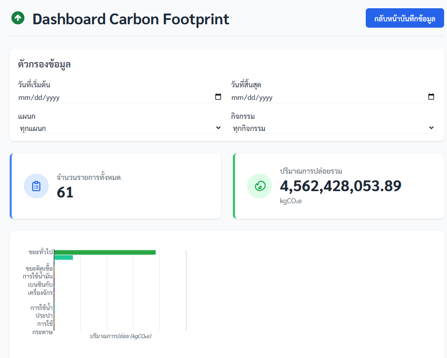
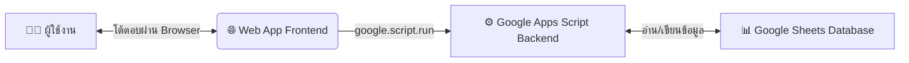

# 🌳 ระบบบันทึกและแสดงผลข้อมูล Carbon Footprint 🌳
โรงพยาบาลอุทัย
Web Application สำหรับบันทึกและติดตามข้อมูล Carbon Footprint เพื่อมุ่งสู่การเป็นโรงพยาบาลคาร์บอนต่ำ

# ✨ คุณสมบัติหลัก (Features)
- 📝 ฟอร์มบันทึกข้อมูลง่าย: ออกแบบให้ใช้งานง่ายสำหรับบุคลากรทุกแผนก

- 📊 แดชบอร์ดไดนามิก: แสดงผลข้อมูลสรุป, กราฟ, และตารางแบบเรียลไทม์

- 📱 รองรับทุกอุปกรณ์: ใช้งานได้ดีทั้งบนคอมพิวเตอร์, แท็บเล็ต, และสมาร์ทโฟน

- 🔍 กรองข้อมูลอัจฉริยะ: ค้นหาและวิเคราะห์ข้อมูลตามช่วงเวลา, แผนก, หรือกิจกรรมได้

- 📈 กราฟเข้าใจง่าย: แสดงข้อมูลการปล่อยก๊าซเรือนกระจกรายกิจกรรมเพื่อการเปรียบเทียบที่ชัดเจน

# 📦 สถาปัตยกรรมระบบ (System Architecture)

# 🚀 การติดตั้งและใช้งาน (Deployment)
    1. สร้างโปรเจกต์ Google Apps Script:
    - ไปที่ script.google.com และสร้างโปรเจกต์ใหม่
    - สร้างไฟล์ Code.gs, index.html, และ dashboard.html แล้วคัดลอกโค้ดจากโปรเจกต์นี้ไปวาง

    2. ตั้งค่า Google Sheet:
    - สร้าง Google Sheet ใหม่เพื่อใช้เป็นฐานข้อมูล
    - คัดลอก Sheet ID จาก URL ของ Google Sheet
    - นำ Sheet ID ไปใส่ในตัวแปร SHEET_ID ที่ไฟล์ Code.gs
    - ตั้งชื่อชีตให้ตรงกับตัวแปร SHEET_NAME ในไฟล์ Code.gs
    
    3. Deploy เป็น Web App:
    - ในหน้าแก้ไขโค้ด, คลิก "การทำให้ใช้งานได้" > "การทำให้ใช้งานได้รายการใหม่"
    - เลือกประเภทเป็น "เว็บแอป"
    - ตั้งค่า "ผู้ที่มีสิทธิ์เข้าถึง" เป็น ทุกคน หรือ ทุกคนที่มีบัญชี Google
    - คลิก "ทำให้ใช้งานได้" และให้สิทธิ์การเข้าถึง
    - คัดลอก URL ของ Web App ที่ได้ไปใช้งาน

# 📧 ติดต่อ
พัฒนาและดูแลโดย: ทีม ENV โรงพยาบาลอุทัย จ.พระนครศรีอยุธยา
หากมีข้อเสนอแนะหรือพบปัญหาการใช้งาน กรุณาติดต่อ  **Suppasit** โทร **035-356-336 ต่อ 128**

